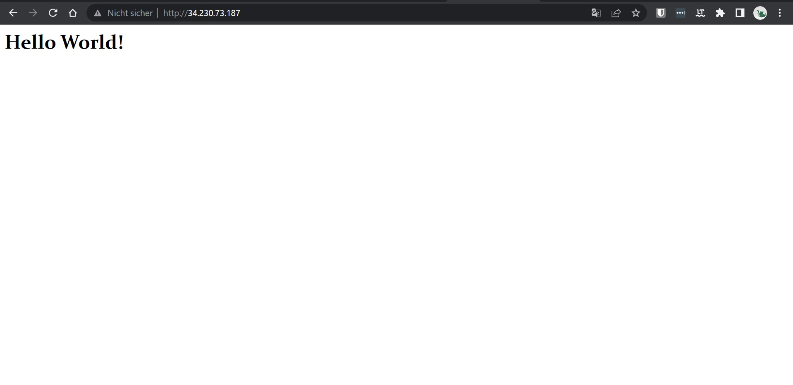
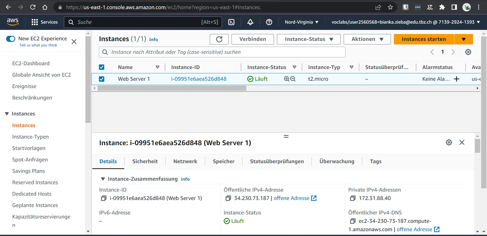
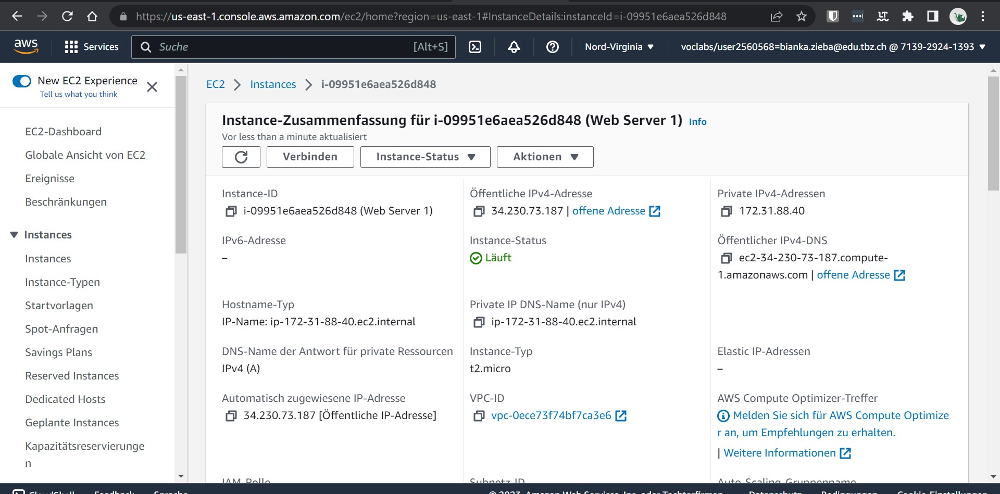
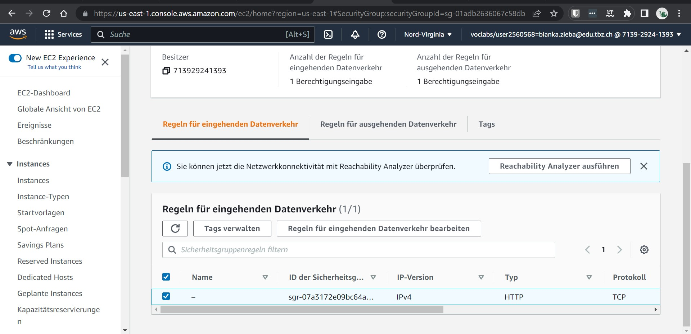
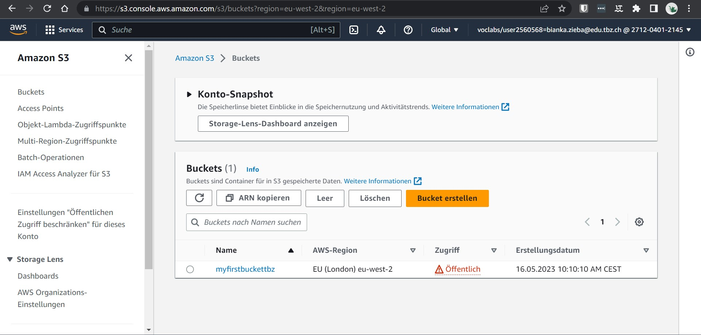
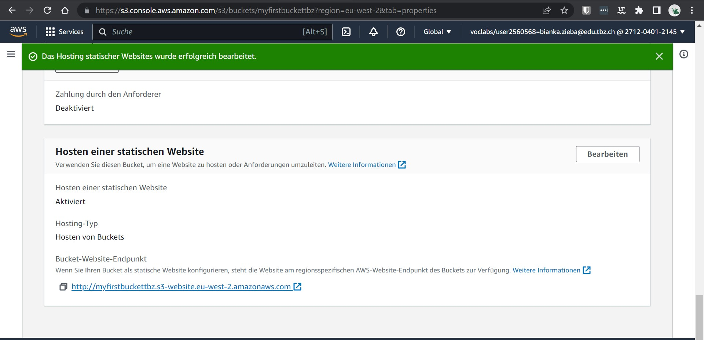
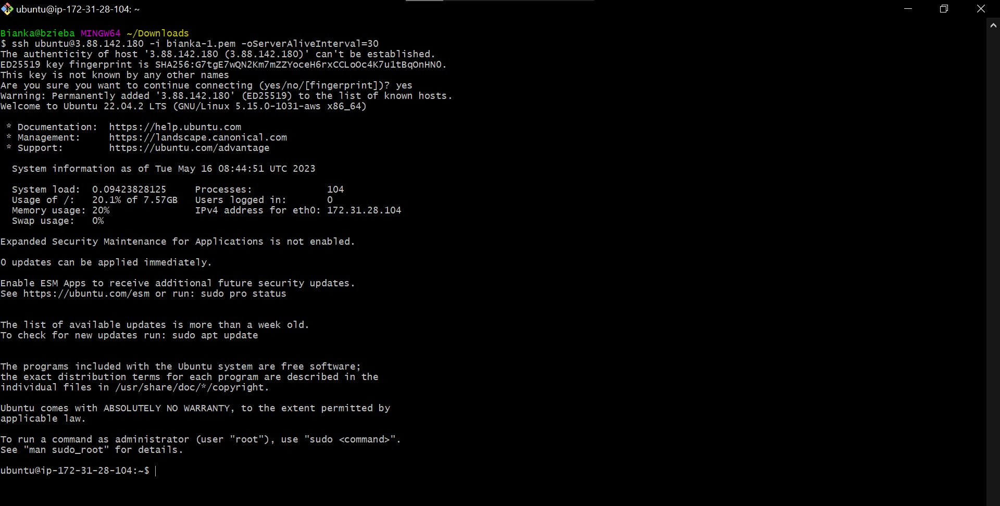
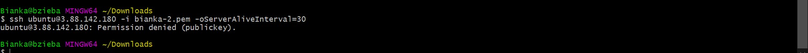
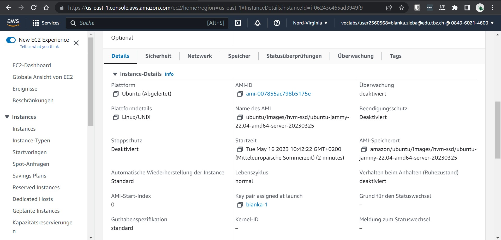

# K02

## IaaS - Virtuelle Server

### A AWS Kurs

#### Lab 4.1 - EC2

##### HTML-Seite, inkl. URL

##### Liste der EC2-Instanzen

##### Details der Web Server-Instanz

##### Security-Group: Liste der Inbound-Regeln

#### Lab 4.2 - S3

##### HTML-Seite, inkl. URL

##### Liste der Buckets

##### Liste der Dateien

##### Eigenschaften von "Static website hosting"

#### B Zugriff mit SSH-Key

##### ssh-Befehl 1 Key-pair

##### ssh-Befehl 2 Key-pair

##### Instanz-Detail

