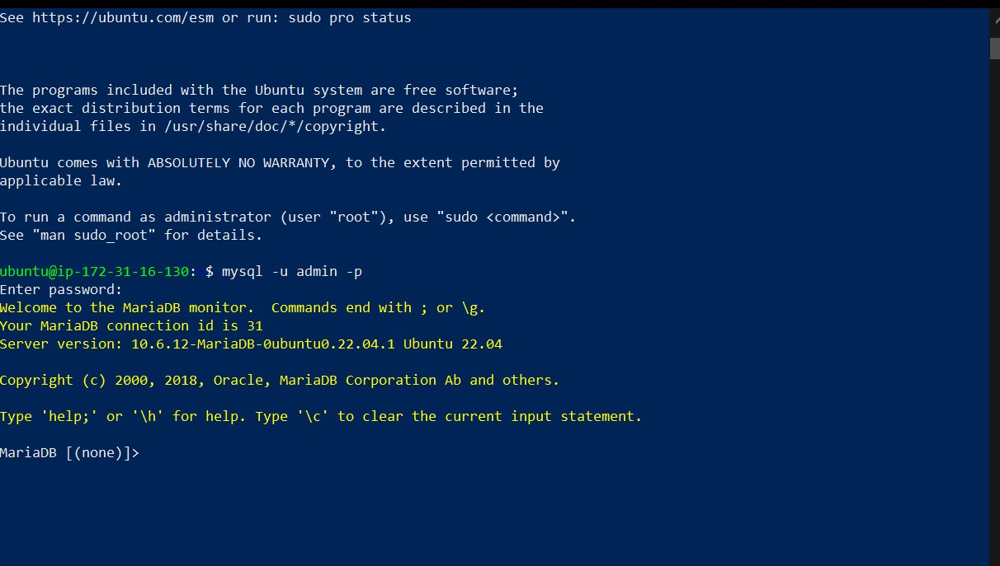
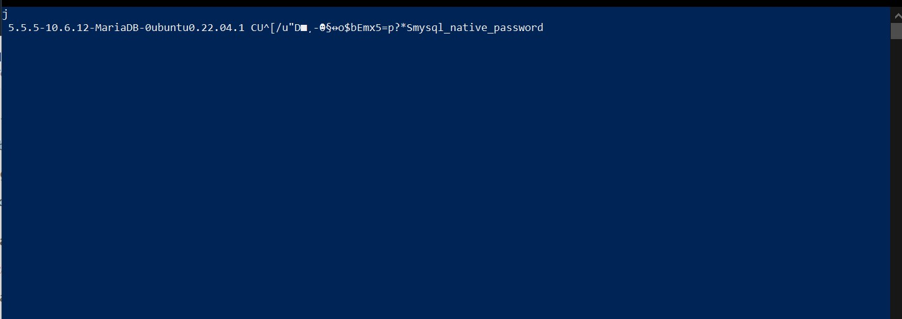
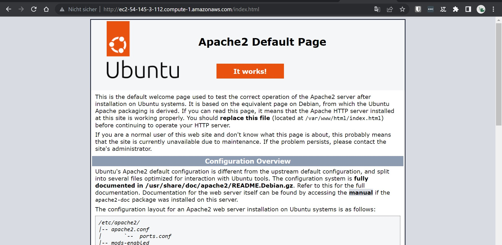
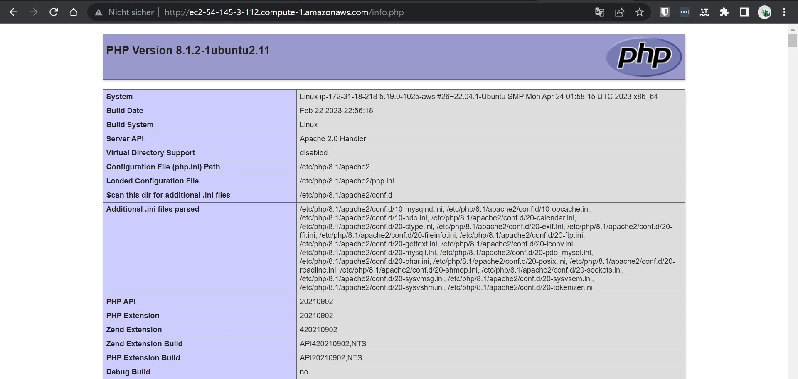
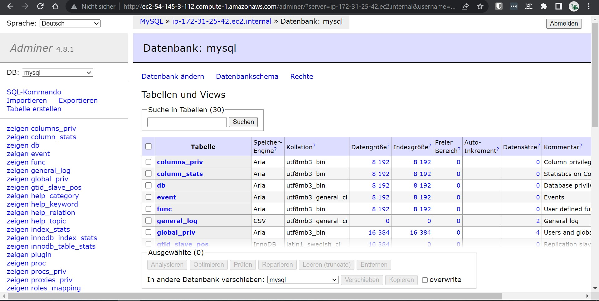
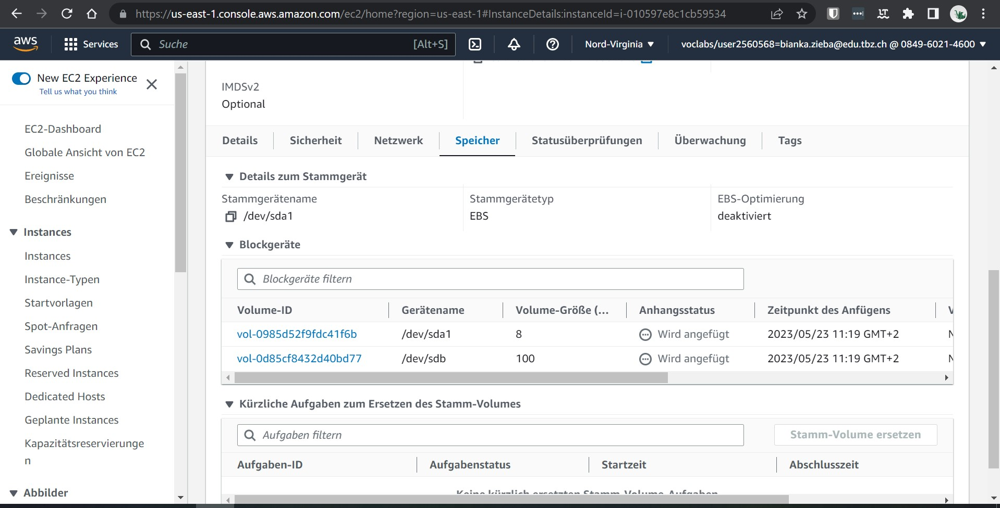

# K03

## Cloud-init und AWS / Storage

### Auftrennung Web- und Datenbankserver

#### Datenbank-Server

##### Verbindung mit dem Datenbankserver

##### Extern auf den Datenbank zugreifen

#### Web-Server

##### index.html

##### info.php

##### db.php

##### Adminer

#### Welchem Speichermodell wird S3 zugeordnet?

S3 wird dem Objektspeichermodell zugeordnet, da es unstrukturierte Daten speichert und über eine eindeutige Kennung ansprechbar macht. Es ist eine skalierbare und zuverlässige Speicherlösung für verschiedene Anwendungsfälle wie Datensicherung und Archivierung.

#### Volume anfügen

#### Volume liste

