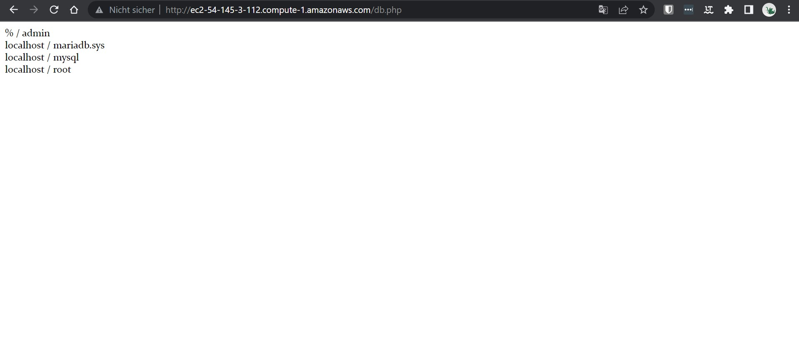

# K03

## Cloud-init und AWS / Storage

### Auftrennung Web- und Datenbankserver

#### Datenbank-Server

##### Verbindung mit dem Datenbankserver

##### Extern auf den Datenbank zugreifen

#### Web-Server

##### index.html

##### info.php

##### db.php

##### Adminer

