# K04

## Netzwerk / Sicherheit

### Netzwerk und Sicherheit Einrichten

#### Subnetz

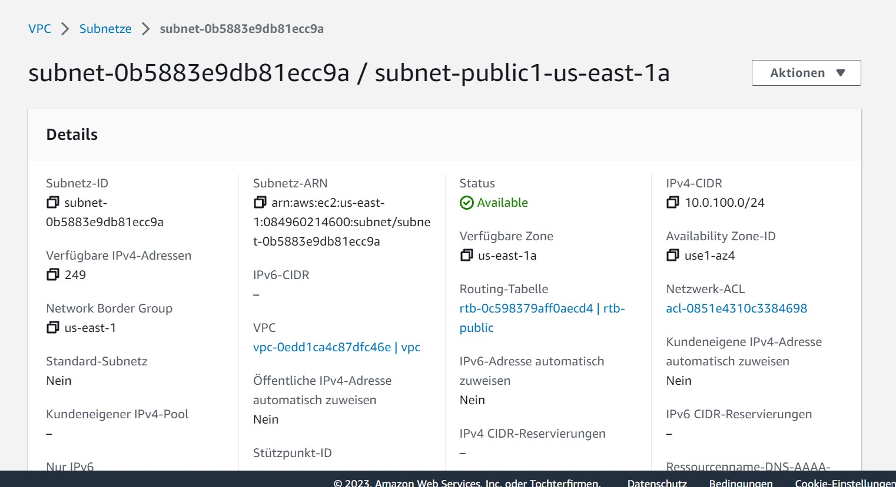

##### Beschreibung

`Subnet-public1-us-east-1a` hat die CIDR von `10.0.100.0/24`. Das entspricht einer IP Liste von `10.0.100.0` bis `10.0.100.255`.

#### Elastic IPs

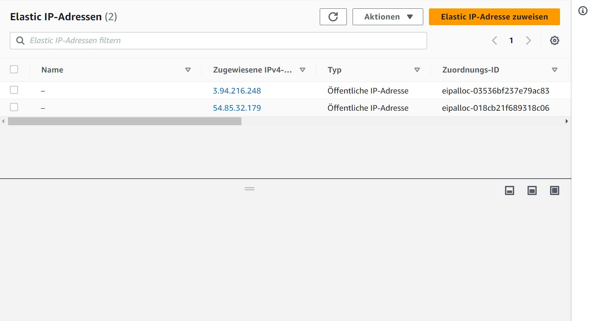

#### Security Groups

##### web

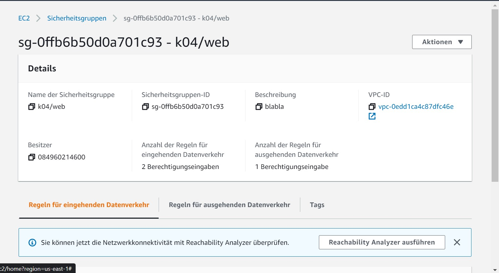
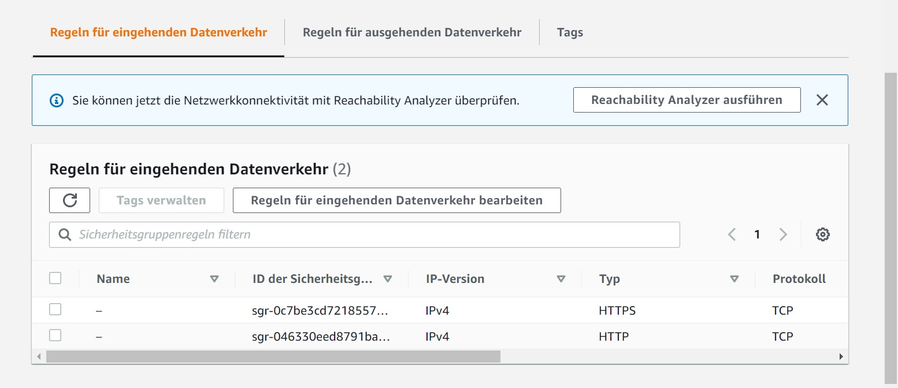

##### db

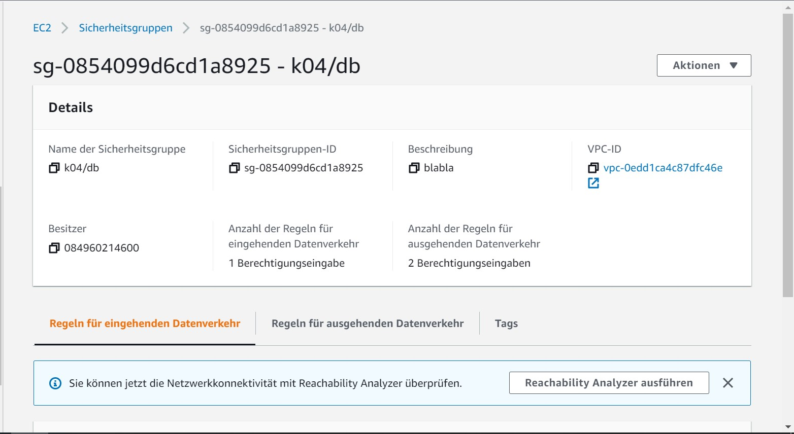
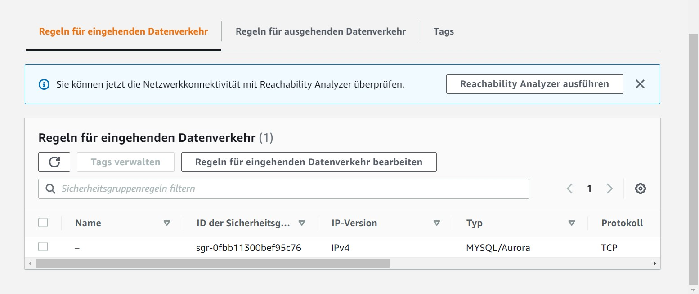

##### Beschreibung

`k04/web` enthält zwei Ports : `80` und `443`. Das ganze kann man von `0.0.0.0/0` (überall) erreichen.
`k04/db` beinhaltet den Port `3306` für die Datenbank. Zugreifbar unter `10.0.100.0/24`.

#### Netzwerk-Interfaces

##### web

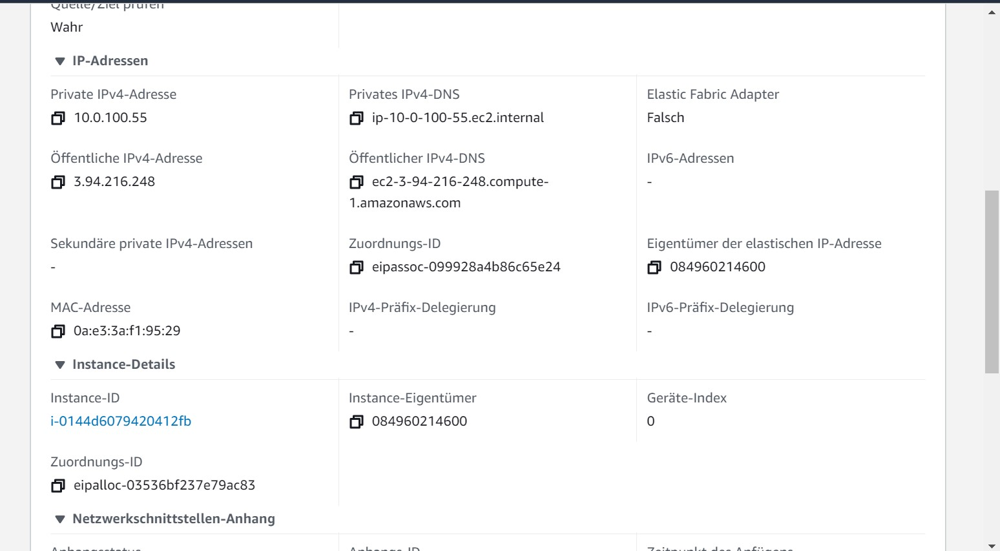

##### db

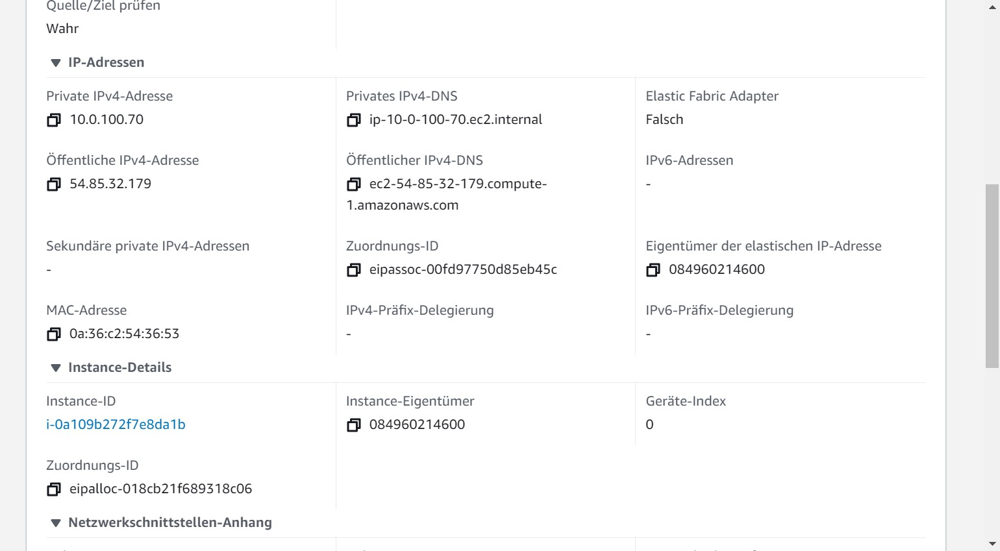

##### Beschreibung

Zusehen sind von mir erstellte Interfaces mit den zugehörigen Subnetz und den Public IPs. Diese kann man den zur EC2 Instanzen zuteilen.

#### Instanzen

##### Web

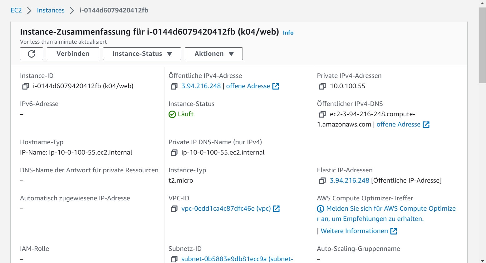

##### db

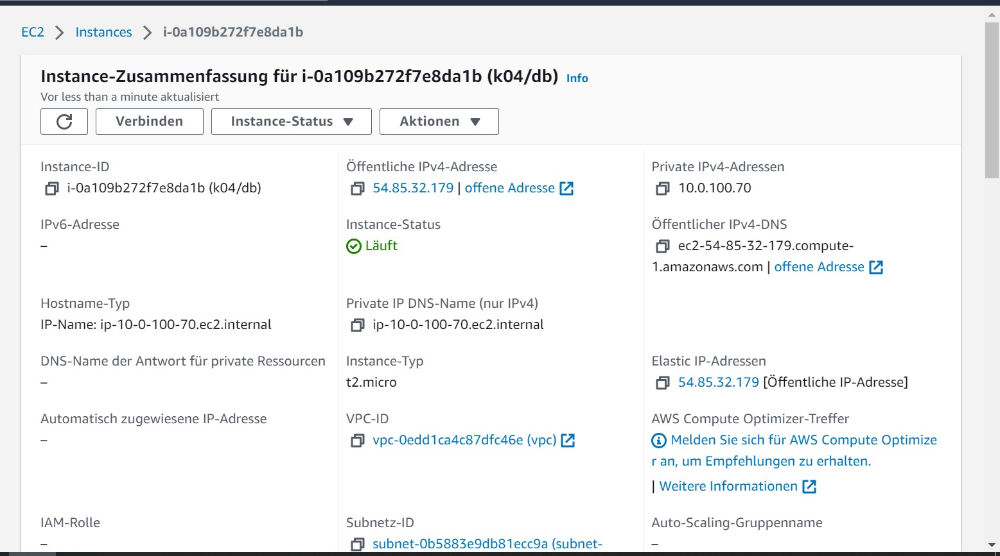

#### Seiten

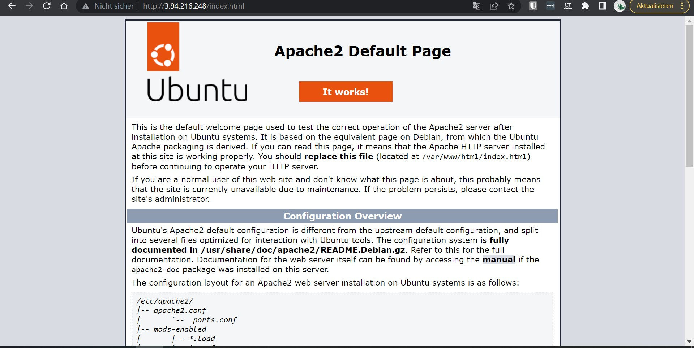
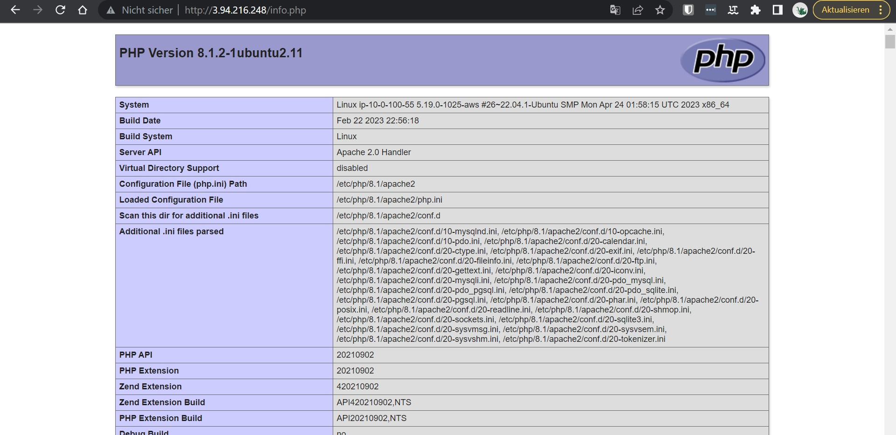
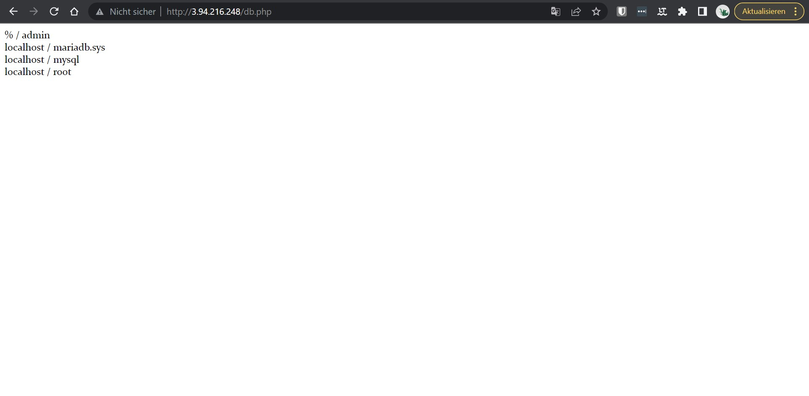
